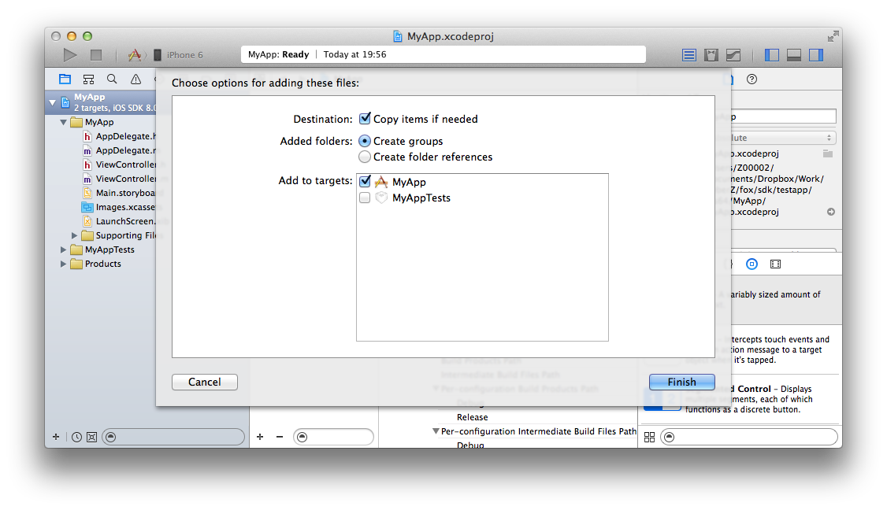
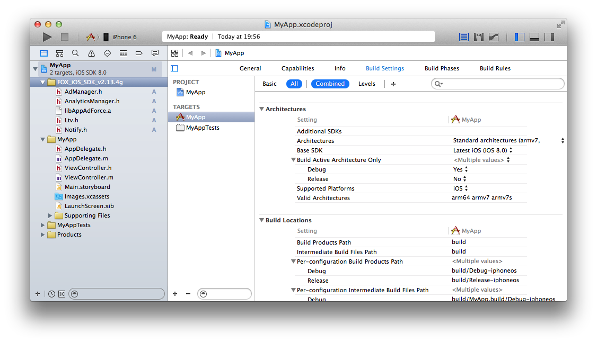
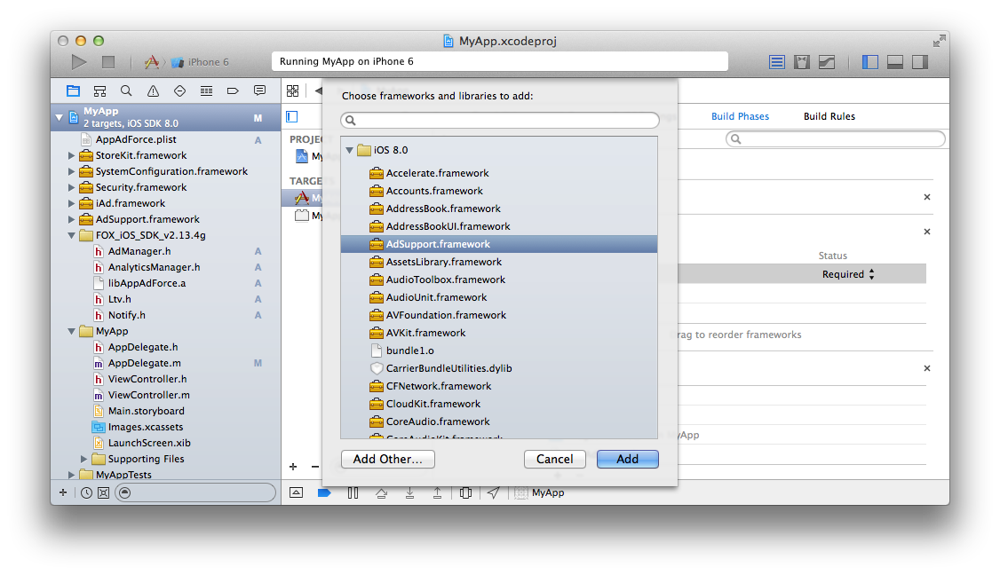
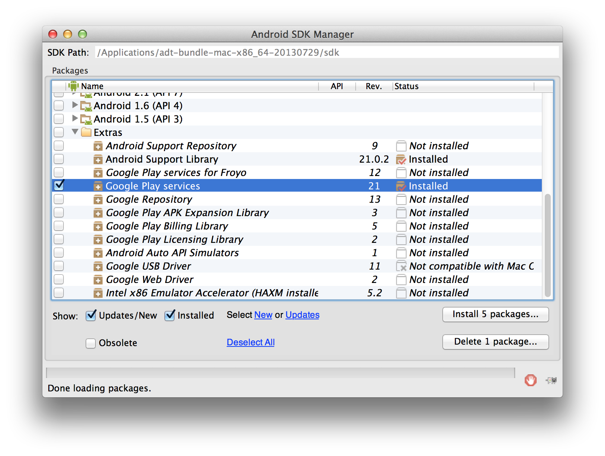

# Force Opetaion Xとは

Force Operation X (以下F.O.X)は、スマートフォンにおける広告効果最適化のためのトータルソリューションプラットフォームです。アプリケーションのダウンロード、ウェブ上でのユーザーアクションの計測はもちろん、スマートフォンユーザーの行動特性に基づいた独自の効果計測基準の元、企業のプロモーションにおける費用対効果を最大化することができます。

本ドキュメントでは、スマートフォンアプリケーションにおける広告効果最大化のためのF.O.X SDK導入手順について説明します。

## F.O.X SDKとは

F.O.X SDKをアプリケーションに導入することで、以下の機能を実現します。

* **インストール計測**

広告流入別にインストール数を計測することができます。

* **LTV計測**

流入元広告別にLife Time Valueを計測します。主な成果地点としては、会員登録、チュートリアル突破、課金などがあります。各広告別に登録率、課金率や課金額などを計測することができます。

* **アクセス解析**

自然流入と広告流入のインストール比較。アプリケーションの起動数やユニークユーザー数(DAU/MAU)。継続率等を計測することができます。


# 1.	概要

本ドキュメントでは、Force Operation X SDK Cocos2d-js プラグインの導入手順について説明します。Force Operation X SDK Cocos2d-jsプラグインはiOSおよびAndroidに対応しています。

Force Operation X SDKでは、インストールおよびLTVの計測、アクセス解析を行うことができます。

SDKの実装後は、アプリケーションの動作及び効果測定の結果に問題のないことを確認した後にマーケットへの申請を行ってください。効果測定のテスト手順については、Force Operation X管理者よりご連絡いたします。

## 1.1	SDK仕様


F.O.X SDKをアプリケーションに導入することで、以下の機能を実現します。


|処理|必須|概要|
|:------:|:------:|:------|
|インストール計測|必須|起動時はブラウザが起動し、Cookie計測により広告効果測定を行います。<br>コンバージョン数、CVRなどを測定することができます。<br>メソッド名：sendConversion|
|LTV計測|オプション|任意の成果地点で成果通知を行い、広告別の課金数や入会数の計測を行います。<br>課金金額、退会数などを測定することができます。<br>メソッド名：sendLtv|
|アクセス解析|オプション|アプリの起動時およびバックグラウンドからの復帰時の起動計測を行います。<br>起動数、アクティブユーザー数(DAU)、継続率などを測定することができます。<br>メソッド名：sendStartSession|


> Force Operation X SDK Cocos2d-js プラグインは、ネイティブ版SDKへのブリッジを行うラッパーとして実装しています。SDK導入には、プラグインと、iOS及びAndroidのネイティブ版SDKが必要となります。_


#2.	iOS用 Xcode プロジェクトの設定


##2.1	SDKの展開

ダウンロードしたSDK「FOX_Cocos2djs_SDK_<version>.zip」をOS上に展開します。Classesフォルダ内に同梱されているファイルは以下の通りです。

ファイル名|必須|概要
:--------|:-------------:|:--------:
jsb_Cocos2dxFox_auto.cpp|必須|JavaScriptからC++を使用するためのjsbファイル
jsb_Cocos2dxFox_auto.hpp|必須|JavaScriptからC++を使用するためのjsbファイル
Cocos2dxFox.h|必須|ヘッダファイル。Cocos2d-xからSDKを使用するためのラッパー
Cocos2dxFox.mm|	iOS専用	|ライブラリファイル。Cocos2d-xからFOX SDKを使用するためのiOS用のラッパー
Cocos2dxFox.cpp|Android専用|ライブラリファイル。Cocos2d-xからFOX SDKを使用するためのAndroid用のラッパー
FoxVersionPlugin.h|オプション|ヘッダファイル。Cocos2d-xからバンドルバージョンを制御するラッパー
FoxVersionDelegate.m|オプション|ライブラリファイル。Cocos2d-xからバンドルバージョンを制御するラッパー|
FoxVersionPlugin.h|オプション|ヘッダファイル。Cocos2d-xからバンドルバージョンを制御するラッパー|
FoxVersionPlugin.m|オプション|ライブラリファイル。Cocos2d-xからバンドルバージョンを制御するラッパー|
FoxReengagePlugin.h|オプション|ライブラリファイル。Cocos2d-xからURLスキーム経由の起動計測を行うためのラッパー|
FoxReengagePlugin.m|オプション|ヘッダファイル。Cocos2d-xからURLスキーム経由の起動計測を行うためのラッパー|

上記のファイルはラッパーですので、実装ファイルはネイティブSDKを組み合わせます。

以下のファイル群が、iOSのネイティブSDKとなっており「FOX_iOS_SDK_<version>」フォルダに同梱されています。

ファイル名|必須|概要
:--------|:-------------:|:--------:
AdManager.h|必須|ヘッダファイル。広告の効果測定を行う。|
libAppAdForce.a|必須|ライブラリファイル。広告の効果測定を行う。|
Ltv.h|オプション|ヘッダファイル。LTV計測を行う。|
AnalyticsManager.h|オプション|ヘッダファイル。アクセス解析を行う。|

※「FOX_Cocos2djs_SDK_<version>.zip」に「FOX_iOS_SDK_<version>」フォルダが含まれていない場合は

SDKダウンロードサイトからFOX_iOS_SDK_<version>.zipをダウンロードの上、ご使用ください。


##2.2	ライブラリの組み込み
* Xcodeのメニュー「File」→「Add Files to “XXX”」を選択
* Cocos2dxFox.h、Cocos2dxFox.mmを組み込んでください。Cocos2dxFox.cppはAndroid用ライブラリであるため、追加の必要はありません。
* バンドルバージョン判定機能を使う場合は、FoxVersionDelegate.h、FoxVersionDelegate .mmとFoxVersionPlugin.h、FoxVersionPlugin.mmの計4ファイルを組み込んでください。
* リエンゲージメント計測を行う場合はFoxReengagePlugin.hとFoxReengagePlugin.mの2ファイルを組み込んでください。
* 「Copy items into destination group’s folder」にチェック







各ファイルの説明は以下の通りです。

<table>
<tr><th>機能名</th><th>必須?</th><th>ファイル名</th></tr>
<tr><td>ライブラリ本体</td><td>必須</td><td>libAppAdForce.a</td></tr>
<tr><td>インストール計測</td><td>必須</td><td>AdManager.h</td></tr>
<tr><td>LTV計測</td><td>オプション</td><td>Ltv.h</td></tr>
<tr><td>アクセス計測</td><td>オプション</td><td>AnalyticsManager.h</td></tr>
</table>


##2.3 Cocos2d-jsプロジェクトのClassesへの導入
* jsb_Cocos2dxFox_auto.cppとjsb_Cocos2dxFox_auto.hppをプロジェクト配下のClassesへコピー<br>
  (Androidプロジェクトと共通)

##2.4 フレームワークの追加

ビルド対象のターゲットをクリックし、「Build Phases」→「Link Binary With Libraries」を選択。「+」ボタンを押し、各フレームワークを選択してください。



次のフレームワークをプロジェクトにリンクしてください。

<table>
<tr><th>フレームワーク名</th><th>Status</th></tr>
<tr><td>AdSupport.framework</td><td>Optional</td></tr>
<tr><td>iAd.framework </td><td>Required</td></tr>
<tr><td>Security.framework </td><td>Required </td></tr>
<tr><td>StoreKit.framework </td><td>Required </td></tr>
<tr><td>SystemConfiguration.framework </td><td>Required </td></tr>
</table>

> AdSupport.frameworkはiOS 6以降で追加されたフレームワークのため、アプリケーションをiOS 5以前でも動作させる(iOS Deployment Targetを5.1以下に設定する)場合にはweak linkを行うために”Optional”に設定してください。


##2.5 SDKの設定

SDKの動作に必要な設定をplistに追加します。「AppAdForce.plist」というファイルをプロジェクトの任意の場所に作成し、次のキーと値を入力してください。
「AppAdForce.plist」という名称のプロパティリストファイルをプロジェクトの任意の場所に作成し、次のキーと値を入力してください。

<table>
<tr>
  <th>Key</th>
  <th>Type</th>
  <th>Value</th>
</tr>
<tr>
  <td>APP_ID</td>
  <td>String</td>
  <td>Force Operation X管理者より連絡しますので、その値を入力してください。</td>
</tr>
<tr>
  <td>SERVER_URL</td>
  <td>String</td>
  <td>Force Operation X管理者より連絡しますので、その値を入力してください。</td>
</tr>
<tr>
  <td>APP_SALT</td>
  <td>String</td>
  <td>Force Operation X管理者より連絡しますので、その値を入力してください。</td>
</tr>
<tr>
  <td>APP_OPTIONS</td>
  <td>String</td>
  <td>何も入力せず、空文字の状態にしてください。</td>
</tr>
<tr>
  <td>CONVERSION_MODE</td>
  <td>String</td>
  <td>1</td>
</tr>
<tr>
  <td>ANALYTICS_APP_KEY</td>
  <td>String</td>
  <td>Force Operation X管理者より連絡しますので、その値を入力してください。<br />アクセス解析を利用しない場合は設定の必要はありません。</td>
</tr>
</table>


任意の場所で右クリック→「New File...」を選択


「Property List」を選択。


「AppAdForce.plist」という名称に変更し、Createボタンをクリック。


作成したプロパティリストファイルを選択。右クリックでメニューを開き、「Add Row」を選択


各キーとバリューを設定。


#3.	Android用 プロジェクトの設定
##3.1	SDKの展開

ダウンロードしたSDK「FOX_Cocos2djs_SDK_<version>.zip」をOS上に展開します。<br>
「FOX_Android_SDK_<version>」フォルダに同梱されている「AppAdForce.jar」を開発環境に導入します。次に、Eclipseプロジェクトへの導入手順について説明します。

|ファイル名|必須|概要|
|:------:|:------:|:------|
|AppAdForce.jar|必須|AndroidのネイティブSDK。通常成果・LTV成果・アクセス解析を計測することができます。|

※「FOX_Cocos2djs_SDK_<version>.zip」に「FOX_Android_SDK_<version>」フォルダが含まれていない場合はSDKダウンロードサイトからFOX_Android_SDK_<version>.zipをダウンロードの上、ご使用ください。

##3.2	プロジェクトへの導入

ダウンロードしたSDK「FOX_Android_SDK_<version>.zip」を展開し、「AppAdForce.jar」をアプリケーションのプロジェクトに組み込んでください。

#### Eclipseプロジェクトへの導入

EclipseプロジェクトへAppAdForce.jarを外部jarとして追加する方法は以下の通りです。

* アプリケーションプロジェクトの「libs」フォルダー配下にAppAdForce.jarをコピー


* アプリケーションを選択し、右クリック>「プロパティ」を選択するとプロパティウィンドウが立ち上がる
* プロパティウィンドウの左のメニューから「Javaのビルド・パス」を選択
* プロパティウィンドウの右側の「ライブラリー」タブを選択し、「Jar追加」を選択します
* アプリケーションの「libs」フォルダに配置した「AppAdForce.jar」を選択する


##3.3 AndroidManifest.xmlの編集
###3.3.1 パーミッションの設定

Force Operation X SDKの実行に必要なパーミッションの設定を<manifest>タグ内に追加します。

	<uses-permission android:name="android.permission.INTERNET" />
	<uses-permission android:name="android.permission.ACCESS_NETWORK_STATE" />

###3.3.2 メタデータの設定
|パラメータ名|必須|概要|
|:------|:------|:------|
|APPADFORCE_APP_ID|必須|Force Operation X管理者より連絡しますので、その値を入力してください。|
|APPADFORCE_SERVER_URL|必須|Force Operation X管理者より連絡しますので、その値を入力してください。|
|APPADFORCE_CRYPTO_SALT|必須|Force Operation X管理者より連絡しますので、その値を入力してください。|
|ANALYTICS_APP_KEY|必須|Force Operation X管理者より連絡しますので、その値を入力してください。|
|APPADFORCE_ID_DIR|オプション|内(外)部ストレージを利用する際、任意の保存するディレクトリ名を指定できます。<br>未指定の場合、パッケージ名でディレクトリが作成されます。|
|APPADFORCE_ID_FILE|オプション|内(外)部ストレージを利用する際、任意の保存する識別子ファイル名を指定できます。<br>未指定の場合、”__FOX_XUNIQ__”でファイルが作成されます。|
|APPADFORCE_USE_EXTERNAL_STORAGE|オプション|0を指定した場合、内(外)部ストレージへの保存は実行しません。|

Force Operation X SDKの実行に必要な情報を<application>タグ内に追加します。

	<meta-data android:name="APPADFORCE_APP_ID" android:value="1" />
	<meta-data android:name="APPADFORCE_SERVER_URL" android:value="012345ABC" />
	<meta-data android:name="APPADFORCE_CRYPTO_SALT" android:value="abcdef123" />
	<meta-data android:name="ANALYTICS_APP_KEY" android:value="xxxxxx" />


###3.3.3 インストールリファラー計測の設定
インストールリファラー計測を行うために必要な設定を<application>タグ内に追加します。

	<receiver android:name="jp.appAdForce.android.InstallReceiver" android:exported="true">
		<intent-filter>
			<action android:name="com.android.vending.INSTALL_REFERRER" />
		</intent-filter>
	</receiver>

#### 複数のBroadCastReceiverを共存させる方法

既に"com.android.vending.INSTALL_REFERRER"に対するレシーバークラスが定義されている場合には、以下のように実装することで共存させることが出来ます。<br>
一つ軸となるレシーバークラスを定義し、そのクラス内で直列に各レシーバーを呼び出すようにします。

[実装例]

* MyReceiverクラス（クラス名は好きに変更して頂いて構いません）

```java
public class MyReceiver extends BroadcastReceiver {
	// F.O.XのINSTALL_REFERRERレシーバー
   jp.appAdForce.android.InstallReceiver foxReceiver;

   // F.O.X以外のINSTALL_REFERRERレシーバー
   jp.co.android.sample.InstallReceiver thirdPartyReceiver;
   jp.co.android.sample.InstallReceiver2 thirdPartyReceiver2;

   public MyReceiver() {
      foxReceiver = new jp.appAdForce.android.InstallReceiver();
      thirdPartyReceiver = new jp.co.android.sample.InstallReceiver();
      thirdPartyReceiver2 = jp.co.android.sample.InstallReceiver2();
   }
   @Override
   public void onReceive(Context context, Intent intent){
       foxReceiver.onReceive(context, intent);

       thirdPartyReceiver.onReceive(context, intent);

       thirdPartyReceiver2.onReceive(context, intent);
   }
}
```

* AndroidManifest.xml

```xml
<receiver
       android:name="jp.co.sample.android.receiver.MyReceiver"
       android:exported="true" >
       <intent-filter>
            <action android:name="com.android.vending.INSTALL_REFERRER" />
       </intent-filter>
</receiver>
```


###3.3.4 AndroidManifest.xmlに関連するその他の設定

#### 3.3.4.1 URLスキームの設定

アプリを外部から起動する際に必須となります。起動させる対象となる<activity>タグ内に追加します。

##### 例 ”smapleapp://”でアプリを起動させる

	<intent-filter>
		<action android:name="android.intent.action.VIEW" />
		<category android:name="android.intent.category.DEFAULT" />
		<category android:name="android.intent.category.BROWSABLE" />
		<data android:scheme="sampleapp" />
	</intent-filter>

##### 使用例

	<activity
    	android:name="com.example.aaa.MainActivity"
        android:label="@string/app_name" >
        <intent-filter>
        	<action android:name="android.intent.action.MAIN" />
        	<category android:name="android.intent.category.LAUNCHER" />
        </intent-filter>

        <!-- URLスキームの設定 （sampleapp://）  -->
        <intent-filter>
        	<action android:name="android.intent.action.VIEW" />
            <category android:name="android.intent.category.DEFAULT" />
            <category android:name="android.intent.category.BROWSABLE" />
            <data android:scheme="sampleapp" />
        </intent-filter>
	</activity>

#### 3.3.4.2 広告IDを利用するためのGoogle Play Services SDKの導入


##### Google Playデベロッパープログラムへの準拠

Force Operation X Android SDKはGoogle Playデベロッパープログラムポリシーに準拠しています。本SDKはポリシーに準拠するために、永続的なデバイス ID（IMEI、MACアドレス及びAndroidID）が取得される場合には広告IDが取得されません。2014年8月1日から、Google Playストアにアップロードされたすべての更新や新着アプリには、広告目的で使用する端末IDには広告ID を利用する必要があります。本ポリシーに準拠するために、以下の手順を行ってください。


##### Google Play Services SDK


広告IDを利用できるようにするために、Google Play Services SDKが組み込まれている必要があります。
アプリケーションにGoogle Play Services SDKが組み込まれていない場合には、次のサイトの手順に従い、導入を行ってください。

[Setting Up Google Play Services | Android Developers](https://developer.android.com/google/play-services/setup.html)


##### Google Play Services SDKの取得

以下に、2014年12月時点での、Google Play Services SDKの導入方法を記載致します。


Google Play Services SDKをインストールしていない場合は、Android SDK Managerからパッケージを取得します。

* Android SDK Managerを起動します。
* Extrasディレクトリ配下のGoogle Play servicesにチェックをいれ、パッケージをインストールします。



##### Google Play Servicesの導入

Google Play Services のライブラリプロジェクトを取得したら、プロジェクトプロパティで外部ライブラリプロジェクトを参照するよう ${ANDROID_SDK_PATH}/extras/google/google_play_services/libproject/google-play-services_libを指定してください。


##### Google Play Servicesを利用するための設定

###### [AndroidManifest.xmlの編集]

Google Play Servicesを利用するために下記の設定をAndroidManifest.xmlの<application>タグ内に記述します。

```xml
<meta-data android:name="com.google.android.gms.version"
        android:value="@integer/google_play_services_version" />
```

###### [Proguardの設定]

Proguardを利用して難読化している場合は、以下の設定を追加してください。

```
-keep class * extends java.util.ListResourceBundle {
    protected Object[][] getContents();
}

-keep public class com.google.android.gms.common.internal.safeparcel.SafeParcelable {
    public static final *** NULL;
}

-keepnames @com.google.android.gms.common.annotation.KeepName class *
-keepclassmembernames class * {
    @com.google.android.gms.common.annotation.KeepName *;
}

-keepnames class * implements android.os.Parcelable {
    public static final ** CREATOR;
}
```


#### 3.3.4.3 外部ストレージを利用した重複排除設定

アプリケーションの初回起動時にSDKが生成した識別IDをローカルストレージまたはSDカードに保存することで、アプリケーション再インストール時に重複判定を行うことができます。

本設定は必須ではありませんが、アプリケーションの再インストールにおける重複検知の精度が大きく向上するため、実装を推奨しております。

###### [パーミッションの設定]

外部ストレージへのファイル読み書きに必要なパーミッションの設定をAndroidManifest.xmlの<manifest>タグ内に追加します。

```xml
<uses-permission android:name="android.permission.READ_EXTERNAL_STORAGE" />
<uses-permission android:name="android.permission.WRITE_EXTERNAL_STORAGE" />
```

上記パーミッションが設定されている場合、次のパスに識別IDファイルが保存されます。

```
Environment.getExternalStorageDirectory().getPath()で取得できるパス/アプリのパッケージ名/__FOX_XUNIQ__
```

###### [（任意）保存ディレクトリ及びファイル名の変更]

保存されるファイルのディレクトリ名は、標準ではパッケージ名で作成されますが、<application>タグ内に以下設定を追加することで、任意のディレクトリ名及びファイル名に変更することができます。

```xml
<meta-data android:name="APPADFORCE_ID_DIR" android:value="任意のディレクトリ名" />
<meta-data android:name="APPADFORCE_ID_FILE" android:value="任意のファイル名" />
```

> 任意のディレクトリ名やファイル名を指定した場合でも、Environment.getExternalStorageDirectory().getPath()の返り値のパス配下に作成します。Environment.getExternalStorageDirectory().getPath()の返り値は端末やOSバージョンによって異なります。 
> "APPADFORCE_ID_DIR"(任意のディレクトリ名)を指定せず、任意のファイル名のみを指定した場合、アプリのパッケージ名のディレクトリが作成され、その配下に任意のファイル名で保存されます。 
> ※"APPADFORCE_ID_FILE"(任意のファイル名)を指定せず、任意のディレクトリ名のみを指定した場合、任意の名前でディレクトリが作成され、その配下に"__FOX_XUNIQ__"で保存されます。
通常は設定の必要はありません。


###### [設定例]

AndroidManifest.xmlの設定例を次に記載します。

```xml
<uses-permission android:name="android.permission.READ_EXTERNAL_STORAGE" />
<uses-permission android:name="android.permission.WRITE_EXTERNAL_STORAGE" />

<application 
	android:icon="@drawable/ic_launcher"
	android:label="@string/app_name" >
	
	<meta-data android:name="APPADFORCE_ID_DIR" android:value="fox_id_dir" />
	<meta-data android:name="APPADFORCE_ID_FILE" android:value="fox_id_file" />
	
</application>

```

上記の例の場合に、保存されるファイルのパスは次になります。

```
Environment.getExternalStorageDirectory().getPath()で取得できるパス/fox_id_dir/fox_id_file
```

###### [外部ストレージの利用停止]

Force Operation X SDKによる外部ストレージへのアクセスを停止したい場合には、AndroidManifest.xmlにAPPADFORCE_USE_EXTERNAL_STORAGEの設定を追加してください。

```xml
<meta-data android:name="APPADFORCE_USE_EXTERNAL_STORAGE" android:value="0" />
```

本設定を行うことで外部ストレージに対する記録が停止しますが、アプリケーションの削除によりデータが常に初期化されるため、正確なインストール計測が行われなくなります。


#### 3.3.4.4 AndroidManifest.xmlの設定例

	<?xml version="1.0" encoding="utf-8"?>
	<manifest xmlns:android="http://schemas.android.com/apk/res/android"
    	package="com.example.aaa"
		android:versionCode="1"
		android:versionName="1.0" >

	    <uses-sdk
    	    android:minSdkVersion="8"
        	android:targetSdkVersion="16" />

	    <application
    	    android:allowBackup="true"
        	android:icon="@drawable/ic_launcher"
	        android:label="@string/app_name"
    	    android:theme="@style/AppTheme" >
        	<activity
            	android:name="com.example.aaa.MainActivity"
            	android:label="@string/app_name" >
            	<intent-filter>
                	<action android:name="android.intent.action.MAIN" />
                	<category android:name="android.intent.category.LAUNCHER" />
            	</intent-filter>

            	<!-- ① URLスキームの設定 （sampleapp://）  -->
	            <intent-filter>
    	            <action android:name="android.intent.action.VIEW" />
        	        <category android:name="android.intent.category.DEFAULT" />
            	    <category android:name="android.intent.category.BROWSABLE" />
                	<data android:scheme="sampleapp" />
	            </intent-filter>
    	    </activity>
        
         	<!-- ② インストールリファラー計測のreceiver設定 -->
	         <receiver android:exported="true"　android:name="jp.appAdForce.android.InstallReceiver" >
    	        <intent-filter>
        	        <action android:name="com.android.vending.INSTALL_REFERRER" />
            	</intent-filter>
	        </receiver>

    	     <!-- ③ 必須meta-dataの設定 -->
        	<meta-data android:name="APPADFORCE_APP_ID" android:value="123" />
	        <meta-data android:name="APPADFORCE_SERVER_URL" android:value="0123456" />
    	    <meta-data android:name="APPADFORCE_CRYPTO_SALT" android:value="abcdefg" />
        	<meta-data android:name="ANALYTICS_APP_KEY" android:value="xxxxxx" />

	        <!-- ④ストレージ保存機能を使わない場合の例 -->
    	    <meta-data android:name="APPADFORCE_USE_EXTERNAL_STORAGE" android:value="0" />

    	    <!-- ⑤GooglePlayServicesを用いてAdvertisingIDを取得する場合 -->
	        <meta-data android:name="com.google.android.gms.version"
				android:value="@integer/google_play_services_version" />
    	</application>
    
    	<uses-permission android:name="android.permission.INTERNET" />
    	<uses-permission android:name="android.permission.ACCESS_NETWORK_STATE" />
	</manifest>

①	URLスキームの設定 → Webブラウザでsampleapp:// にアクセスでMainActivityが起動するよう設定<br>
②	インストールリファラー計測のreceiver設定<br>
③	必須meta-dataの設定<br>
④	内(外)部ストレージ保存機能を使用しない設定：ON
⑤	プロジェクトにGooglePlayServicesライブラリを導入している場合に必ず設定

##3.4 Cocos2d-jsプロジェクトのClassesへの導入

「FOX_Cocos2djs_SDK_<version>.zip」を展開し、以下の操作を行います。

* Android/Classes配下のCocos2dxFox.hとCocos2dxFox.cppをプロジェクト配下のClassesへコピー
* Android/Classes配下のjsb_Cocos2dxFox_auto.cppとjsb_Cocos2dxFox_auto.hppをプロジェクト配下のClassesへコピー
* プロジェクト内配下のjni/Android.mkにCocos2dxFox.cppファイルとjsb_Cocos2dxFox_auto.cppファイルを追記し、ビルドの対象に含める<br>
　→ LOCAL_SRC_FILESにClasses/Cocos2dxFox.cppとClasses/jsb_Cocos2dxFox_auto.cppの指定を追加してください。

　
Cocos2dxFox.cppのJniHelper.hのincludeパスを開発環境に合わせる（以下はその例）

	#include <iostrem>
	#inclued “cocos2d.h”
	#include “Cocos2dxFox.h”
	#include “../android/jni/JniHelper.h”


#4 インストール計測の実装

## iOS・Android共通設定

FOXプラグインをCocos2d-xに登録するため、AppDelegate.cppを編集します。<br>
まず、以下のようにヘッダファイルをインクルードします。

	#include "jsb_Cocos2dxFox_auto.hpp"

次に、AppDelegate::applicationDidFinishLaunching()メソッド内のsc->start();よりも前に以下のコードを記述します。

	sc->addRegisterCallback(register_all_jsb_Cocos2dxFox_auto);
	sc->start();

##4.1 インストールの計測

初回起動のインストール計測を実装することで、広告の効果測定を行うことができます。初回起動時に、ブラウザを起動し、広告クリック時に付与されたCookieの情報を照合することで、成果の計測を行います。

初回起動時にブラウザを起動するために、アプリケーションの起動時に必ず呼ばれる箇所に効果測定用の処理を追加します。
	
成果通知のコードをJavaScript上に記述

	cc.FoxPlugin.sendConversion(“default”);

sendConversionの引数には、通常は上記の通り"default"という文字列を入力してください。デフォルトでは標準で用意されたページが表示されますが、遷移先のURLをF.O.X管理画面上で任意に設定することが可能です。

特定のURLヘ遷移させたい場合や、アプリケーションで動的にURLを生成したい場合には、URLの文字列を設定してください。

	cc.FoxPlugin.sendConversion(“http://yourhost.com/yourpage.html”);

sendConversionメソッドの第二引数に広告主端末IDを渡すことができます。例えば、アプリ起動時にUUIDを生成し、初回起動の成果と紐付けて管理したい場合等に、利用できます。


	cc.FoxPlugin.sendConversion("default", "your unique id");

> sendConversionは起動直後の処理として実装される必要があるため、ログインIDなどのユーザーアクションが伴う値を引数として渡すことはできません。


またAndroidの場合、URLスキーム経由の起動を計測するために、URLスキームが設定されている全てのActivityのonResume()にsendConversionWithUrlSchemeメソッドを実装します。

クラスをインポート

	import jp.appAdForce.android.cocos2dx.Cocos2dxAdManager;
	
アプリケーション起動時の起動計測（MainActivityクラスへの実装例）

	public class MainActivity extends Cocos2dxActivity {
	
		@Override
		protected void onResume() {
			super.onResume();
			Cocos2dxAdManager.sendConversionWithUrlScheme(this);
		}
	}

URLスキームで起動されるActivityのlaunchModeが"singleTask"または"singleInstance"の場合は、URLスキーム経由でパラメータを受け取るためにonNewIntentメソッドをoverrideし、以下のようにsetIntentメソッドをコールしてください。

	@Override
	protected void onNewIntent(Intent intent) {
    	super.onNewIntent(intent);
	    setIntent(intent);
	}


#5 LTV計測の実装


LTV計測により、広告流入別の課金金額や入会数などを計測することができます。計測のために、任意の地点にLTV成果通信を行うコードを追加します。

ソースの編集は、成果が上がった後に実行されるスクリプトに処理を記述します。例えば、会員登録やアプリ内課金後の課金計測では、登録・課金処理実行後のコールバック内にLTV計測処理を記述します。

成果がアプリ内部で発生する場合、成果処理部に以下のように記述してください。
LTV成果の計測のコードをJavaScript上に記述

	cc.FoxPlugin.sendLtv(成果地点ID);

> 成果地点ID(必須)：管理者より連絡します。その値を入力してください。


アプリ内部の成果に、広告主端末ID（会員IDなど）を含める事ができ、これを基準とした成果計測が行えます。LTV成果に広告主端末IDを付与したい場合は以下のように記述してください。
	cc.FoxPlugin.sendLtv(成果地点ID, "広告主端末ID");
	
> 成果地点ID(必須)：管理者より連絡します。その値を入力してください。
広告主端末ID(オプション)：広告主様が管理しているユニークな識別子（会員IDなど）です。
指定できる値は64文字以内の半角英数字です。

アプリ内計測時には、パラメータをオプションとして設定する事が可能です。

	cc.FoxPlugin.addParameter("パラメータ名", "値");

指定できるパラメータは次の通りです。

|パラメータ名|概要|
|:------|:------|
|_sku|Stock Keeping Unit(商品管理コード)<br>（半角英数字32文字まで）<br>商品の在庫管理する際に使用してください|
|_price|Price<br>（整数値　日本円）<br>売上額を管理する際に使用してください。|
|_currency|Currency<br>（半角英字3文字の通貨コード）<br>通貨別で課金額を集計する際に使用してください。<br>通貨が設定されていない場合、PriceをJPY(日本円)として扱います。|
|任意でパラメータを加える事も可能です。|FoxPlugin::addParameter(“パラメータ名”, “値”);<br>※1 同一パラメータ名を記述した場合は、後者が有効となります。<br>※2 アンダースコア（"_"）をパラメータ名の先頭に記述しないでください。<br>※3 半角英数字以外は使用できません。|

CC_LTV_PARAM_CURRENCYには[ISO 4217](http://ja.wikipedia.org/wiki/ISO_4217)で定義された通貨コードを指定してください。

設定例：

	cc.FoxPlugin.addParameter("_sku", “ABC1234”);
	cc.FoxPlugin.addParameter("_price", “2000”);
	cc.FoxPlugin.addParameter("_currency", “JPY”);
	cc.FoxPlugin.addParameter(“my_param”, “ABC”);
	cc.FoxPlugin.sendLtv(70, “Taro”);


#6 アクセス解析

アクセス解析を導入することで、自然流入・広告流入別の起動数、アクティブユーザー数(DAU/MAU)や継続率を計測することができます。アクセス解析では、アプリケーションが起動、もしくはバックグラウンドから復帰する際にセッション計測を行うコードを追加します。不要の場合には、本項目の実装を省略できます。

####iPhone プロジェクト
iPhoneの場合、以下の設定が必要です。

JavaScript上のアプリ起動地点となる箇所に以下を記述してください。

	cc.FoxPlugin.sendStartSession();

アプリのバックグラウンドからの復帰を計測するために、AppDelegate.cppのapplicationWillEnterForegroundに以下のように記述してください。

	#include "Cocos2dxFox.h"
	
---

	FoxPlugin::sendStartSession();
	
####Android プロジェクト
Androidの場合、以下の設定が必要です。

アプリケーションの起動及び、バックグラウンドからの復帰を計測するために、ActivityのonResume()にコードを追加します。

クラスをインポート

	import jp.appAdForce.android.AnalyticsManager;
	
アプリケーション起動時の起動計測（MainActivityクラスへの実装例）

	public class MainActivity extends Activity {

		@Override
		protected void onResume() {
				super.onResume();
			AnalyticsManager.sendStartSession(this);
		}
	}

#####＜JavaのActivity上でonResume()が使えない場合＞
※iOSで既に以下の記述を行っている場合は必要ありません

JavaScript上のアプリ起動地点となる箇所に以下を記述してください。

	cc.FoxPlugin.sendStartSession();

アプリのバックグラウンドからの復帰を計測するために、AppDelegate.cppのapplicationWillEnterForegroundに以下のように記述してください。

	#include “Cocos2dxFox.h”
	
---
	
	FoxPlugin::sendStartSession();
	
	
> ※アプリケーションがバックグラウンドから復帰した際に、そのActivityに起動計測の実装がされていない場合など、正確なアクティブユーザー数が計測できなくなります。<br>
※JavaのonResume()とC++のapplicationWillEnterForegroundの両方でsendStartSession()が実行されていた場合、１ユーザーから２重にアプリ起動情報が送信されるため必ずどちらかで実装してください。


#### アクセス解析による課金計測
本機能では広告経由および自然流入経由での売上をそれぞれ計測可能です。
アクセス解析機能を利用し、自然流入経由を含めた広告別の課金計測を行うことができます。アクセス解析による課金計測を行うために、次のsendEventメソッドを実装します。

※広告経由の売上のみを計測したい場合はLTV計測で計測可能ですので本機能の実装は必要ありません。<br>
※主に自然流入経由の売上を計測したい場合などに本機能を実装してください。

|パラメータ|タイプ|最大長|必須|概要|
|:---|:---:|:---:|:---:|:---|
|eventName|String|255|必須|トラッキングを行うイベントを識別できる任意の名前を設定します。<br>イベント名は自由に設定可能です。<br>イベント単位でグルーピングされ、それぞれのイベントごとに集計を行うことができます。|
|action|String|255|オプション|イベントに属するアクション名を設定します。<br>アクション名は自由に設定可能です。<br>各イベントをドリルダウンすることで、アクションごとに集計を行うことができます。<br>特に指定しない場合は””を設定してください。|
|label|String|255|オプション|アクションに属するラベル名を設定します。<br>ラベル名は自由に設定可能です。<br>各アクションをドリルダウンすることで、ラベルごとに集計を行うことができます。<br>特に指定しない場合は””を設定してください。|
|orderID|String|255|オプション|注文番号。特に指定いない場合は""を設定してください。|
|sku|String|255|オプション|商品コード。特に指定しない場合は””を設定してください。|
|itemName|String|255|必須|商品名|
|price|double||必須|商品単価|
|quantity|int||必須|購入数|
|currency|String||オプション|通貨コード。指定しなかった場合は"JPY"|

JavaScript上では以下のように記述します。

	cc.FoxPlugin.sendEvent(eventName, action, label, orderId, sku, itemName, price, quantity, currency);


LTV計測においても課金を成果地点としている場合には、同一の箇所にLTVとアクセス解析のそれぞれの計測処理を実装します。
サンプルとして、以下にアメリカドルで9.99ドルの課金を行った場合の実装例を記載致します。


	// LTV計測による課金計測
	cc.FoxPlugin.addParameter("_price", “9.99”);
	cc.FoxPlugin.addParameter("_currency", “USD”);
	cc.FoxPlugin.sendLtv(成果地点ID);

	// アクセス解析による課金計測
	cc.FoxPlugin.sendEvent(eventName, action, null, orderId, sku, itemName, 9.99, 1, "USD");



#7 AndroidプロジェクトでProGuardを利用する場合

ProGuardを利用してF.O.X SDKを導入したアプリケーションを難読化する際に、警告が発生する場合があります。その際には、警告を回避するため以下の設定を追加してください。

	-libraryjars libs/AppAdForce.jar
	-keep interface jp.appAdForce.** { *; }
	-keep class jp.appAdForce.** { *; }
	-keep class jp.co.dimage.** { *; }
	-keep class com.google.android.gms.ads.identifier.* { *; }
	-dontwarn jp.appAdForce.android.ane.AppAdForceContext
	-dontwarn jp.appAdForce.android.ane.AppAdForceExtension
	-dontwarn com.adobe.fre.FREContext
	-dontwarn com.adobe.fre.FREExtension
	-dontwarn com.adobe.fre.FREFunction
	-dontwarn com.adobe.fre.FREObject
	-dontwarn com.ansca.**
	-dontwarn com.naef.jnlua.**

※GooglePlayServiceSDKを導入されている場合、以下のページで記載されているkeep指定が記述されているかご確認ください。

[Google Play Services導入時のProguard対応](https://developer.android.com/google/play-services/setup.html#Proguard)


#8 疎通テストの実施

マーケットへの申請までに、Force Operation Xを導入した状態で十分にテストを行い、アプリケーションの動作に問題がないことを確認してください。

効果測定テストの手順については、管理者よりご連絡いたしますのでその手順に従いテストを実施してください。

成果のための通信は、起動後に一度のみ行わるため、二回目以降の起動では通信が発生しません。続けて効果測定テストを行いたい場合には、アプリケーションをアンインストールし、再度インストールから行ってください。

##8.1 テストの手順

SDKが正常に導入されていることを確認するためのテスト手順は以下の通りです。
ProGuardを掛けてリリースを行う場合、必ずProGuardを掛けた状態でテストの実施をお願い致します。

1. テスト用端末にテストアプリがインストールされている場合には、アンインストール
2. テスト用端末の「設定」→「Safari」→「Cookieとデータを消去」によりCookieを削除
3. 弊社より発行したテスト用URLをクリック<br>
   ※ テスト用URLは必ずOSに設定されているデフォルトブラウザでリクエストされるようにしてください。
デフォルトブラウザとは、URLをクリックした際に自動で起動するブラウザのことです。
メールアプリやQRコードアプリを利用され、そのアプリ内WebViewで遷移した場合には計測できません。
4. マーケットへリダイレクト<br>
   ※ テストURLの場合には、遷移先がなくエラーダイアログが表示される場合がありますが、問題ありません。
5. テスト用端末にテストアプリをインストール
6. アプリを起動、ブラウザが起動<br>
   ※ ここでブラウザが起動しない場合には、正常に設定が行われていません。
設定を見直していただき、問題が見当たらない場合には弊社へご連絡ください。
7. LTV地点まで画面遷移
8. アプリを終了し、バックグラウンドからも削除
9. 再度アプリを起動
10. 弊社へ3,6,7,9の時間をお伝えください。正常に計測が行われているか確認致します。
11. 弊社側の確認にて問題がなければテスト完了となります。


#9 最後に必ずご確認ください（これまで発生したトラブル集）

###URLスキームの設定がされずリリースされたためブラウザからアプリに遷移ができない

Cookie計測を行いブラウザを起動した場合には、URLスキームを利用してアプリケーションに遷移します。

この際、独自のURLスキームが設定されている必要があります。


###URLスキームに大文字が含まれ、正常にアプリに遷移されない

環境によって、URLスキームの大文字小文字が判別されないことにより正常にURLスキームの遷移が行えない場合があります。

URLスキームは全て小文字で設定を行ってください。


###F.O.Xで確認できるインストール数の値がマーケットの数字より大きい

F.O.Xではいくつかの方式を組み合わせて端末の重複インストール検知を行っています。重複検知が行えない設定では、同一端末で再インストールされる度にF.O.Xは新規のインストールと判定してしまいます。重複検知の精度を向上するために、以下の設定を行ってください。

* 広告IDを利用するためのGoogle Play Services SDKの導入
* （オプション）外部ストレージを利用した重複排除設定

